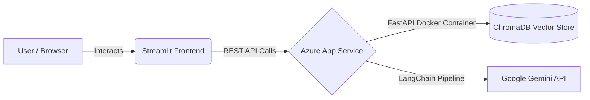

# ☁️ Cloud-Native RAG Assistant (Decoupled Architecture)

[](https://tolis-ai.streamlit.app/)
[]()
[]()
[]()
[]()
[]()
[]()

A fully production-ready, cloud-native **Retrieval-Augmented Generation (RAG)** application. This project demonstrates a modern microservices approach by decoupling a robust AI backend (hosted on Microsoft Azure via Docker) from an interactive frontend (hosted on Streamlit Cloud).

👉 **[Try the Live Application Here](https://tolis-ai.streamlit.app/)**

---

## 🏛️ System Architecture

The application follows a strict Separation of Concerns (Frontend vs. Backend API):

1. **Frontend (Streamlit):** A lightweight web interface that collects user input and communicates with the backend via REST HTTP requests.
2. **Backend API (FastAPI):** A containerized RESTful API handling all the heavy lifting, business logic, and MLOps.
3. **AI Engine (LangChain & Gemini):** Implements a strict RAG pipeline. It vectorizes uploaded documents, stores them in ChromaDB, and forces the LLM to answer *only* based on the retrieved context (Anti-hallucination).


*(Note: The above diagram is mental, but shows the exact data flow of the app).*

---

## 🚀 Key Features

* **Upload Custom Knowledge:** Users can upload custom text data. The text is split into chunks, embedded, and saved in a localized Vector Database (`ChromaDB`).
* **Context-Aware Q&A (RAG):** When asked a question, the API performs a similarity search in the Vector DB and strictly prompts the AI to answer using *only* the provided context.
* **Anti-Hallucination:** If the answer is not found in the uploaded text, the AI is instructed to safely state that it does not know.
* **Fully Automated CI/CD:** Every push to the `main` branch triggers a GitHub Action that builds a new Docker Image, pushes it to Docker Hub, and automatically redeploys the Azure Web App.

---

## 🛠️ Tech Stack

**Backend & AI Engine:**
* **Framework:** FastAPI, Uvicorn
* **AI/MLOps:** LangChain, Google Gemini API (`gemini-3.1-flash-lite`), ChromaDB
* **Data Models:** Pydantic

**DevOps & Cloud:**
* **Containerization:** Docker, Docker Hub
* **CI/CD:** GitHub Actions
* **Cloud Hosting:** Microsoft Azure App Services (Linux Container)
* **Infrastructure as Code:** Uses Terraform to automatically provision Azure Resource Groups, App Service Plans, and Linux Web Apps.

**Frontend:**
* **Framework:** Streamlit
* **Integration:** `requests` library
* **Hosting:** Streamlit Community Cloud

---

## 📂 Modular Repository Structure

The backend code is organized following enterprise standards (Separation of Concerns):

```text
├── .github/workflows/
│   └── deploy.yml        # CI/CD Pipeline for Azure deployment
├── src/
│   ├── ai_engine.py      # Core LangChain, RAG, and Gemini logic
│   ├── routers.py        # FastAPI endpoint definitions
│   ├── schemas.py        # Pydantic data models
│   └── main.py           # Application entry point
├── app.py                # Streamlit Frontend UI
├── Dockerfile            # Container build instructions
├── .dockerignore         
├── .gitignore            
└── requirements.txt      # Dependencies
```

---

## 🔌 API Endpoints Reference

If you wish to hit the API directly (e.g., via Postman or Swagger UI), the Azure Backend exposes the following main routes:

* `POST /upload-knowledge`: Accepts a JSON payload `{"text": "...", "source_name": "..."}`. Embeds the text and saves it to ChromaDB.
* `POST /ask`: Accepts `{"question": "..."}`. Retrieves context from the DB and returns the AI's answer along with the exact context used.
* `GET /docs`: Auto-generated Swagger UI documentation.

---

## ⚙️ How to Run Locally

If you want to run this project on your local machine:

1. **Clone the repository:**
   ```bash
   git clone https://github.com/tolis-snr/cloud-ai-api.git
   cd cloud-ai-api
   ```

2. **Set up Environment Variables:**
   Create a `.env` file in the root directory and add your Google Gemini API key:
   ```env
   GEMINI_API_KEY=your_api_key_here
   ```

3. **Install Dependencies:**
   ```bash
   pip install -r requirements.txt
   ```

4. **Run the Backend (FastAPI):**
   ```bash
   uvicorn src.main:app --reload
   ```
   *(The API will be available at `http://localhost:8000/docs`)*

5. **Run the Frontend (Streamlit):**
   Open a new terminal and run:
   ```bash
   streamlit run app.py
   ```